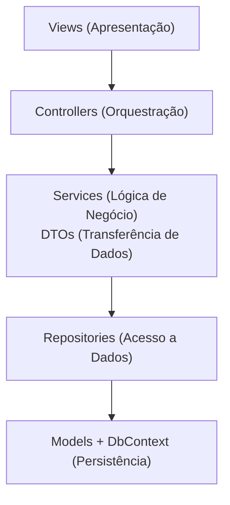
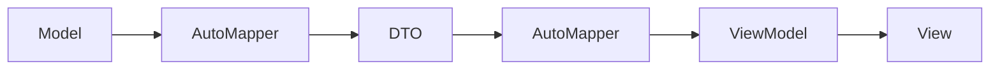
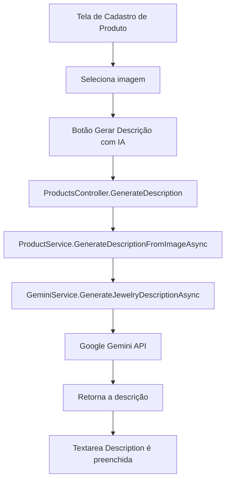
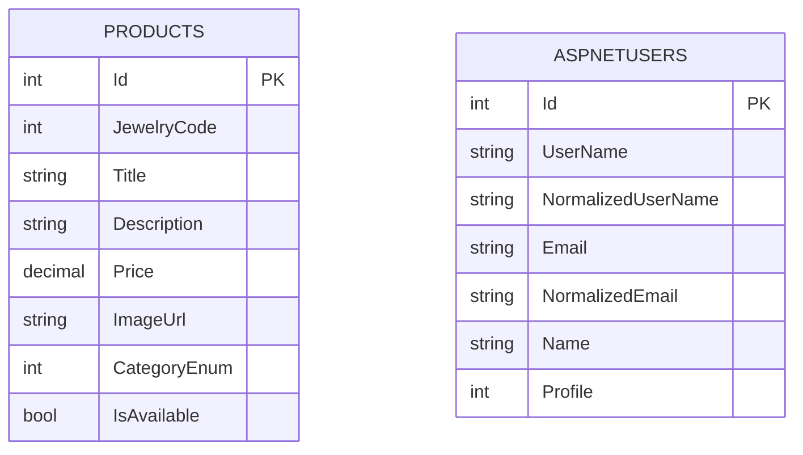

# 💎 Camila Reis — Vitrine de Semijoias & Acessórios

Site desenvolvido em ASP.NET Core 8 MVC para o **FDEVS2026** que serve como catálogo interativo e gerenciador de vitrine digital. O sistema foi projetado sob princípios sólidos de engenharia de software para otimizar a exibição de produtos, profissionalizar o contato com o cliente e eliminar gargalos logísticos do comércio tradicional por redes sociais.

## 🎯 O Cenário & O Problema

O modelo original de vendas da marca baseava-se na postagem em massa de fotos no Status do WhatsApp. Embora acessível, essa abordagem gerava dores profundas para a empreendedora e suas clientes:


* **Gargalo de Conexão (UX Prejudicada):** O carregamento de dezenas de mídias sequenciais no WhatsApp consome muitos dados. Em conexões instáveis, as fotos demoram para carregar, gerando atrito e fazendo com que potenciais clientes desistam de ver as peças;
* **Refugo de Trabalho e Volatilidade:** Como os status expiram rigidamente a cada 24 horas, havia a necessidade constante de reupload manual das mesmas mídias, gerando um esforço repetitivo e ineficiente;
* **Desgaste Logístico:** A marca realiza atendimentos presenciais e a domicílio. Depender exclusivamente do transporte e da abertura do mostruário físico para apresentar todo o catálogo gera desgaste prático, além de limitar o tempo de escolha da cliente.

## 🚀 A Solução Desenvolvida

O sistema centraliza o catálogo de forma persistente, leve e sempre disponível, transformando a experiência de compra e venda.

## 👩‍💻 Benefícios para a Cliente

* **Navegação Fluida (Mobile-First):** Interface responsiva e otimizada para carregar rapidamente em redes móveis limitadas;
* **Filtro Inteligente:** Escaneamento rápido de peças por categorias (Anéis, Brincos, Colares), sem a necessidade de rolar por dezenas de stories expirados;
* **Visualização Avançada:** Modais intuitivos para conferir códigos, especificações de banho e preços de forma imediata antes de iniciar o atendimento.

## 💼 Benefícios para o Negócio

* **Catálogo Permanente:** Fim do ciclo de expiração de 24 horas. O produto fica disponível na nuvem, a disponibidade e exibição das peça pode ser alterada com facilidade na área administrativa;
* **Otimização do Tempo Presencial:** A cliente navega pela vitrine antes do encontro presencial, selecionando previamente as peças de interesse, tornando o atendimento focado e estratégico;
* **Painel Administrativo Isolado:** Controle absoluto para cadastro, edição, exclusão e gerenciamento visual de estoque/disponibilidade.

## 🏗️ Arquitetura e Padrões de Projeto

O projeto adota uma arquitetura em camadas, fundamentada nos princípios SOLID e no desacoplamento de código para garantir manutenibilidade e testabilidade.



## 🔄 Padrões Implementados

* **Repository Pattern:** Abstração completa da camada de dados (IProductRepository), isolando o Entity Framework das regras de negócio e facilitando a escrita de testes unitários;
* **Service Layer Pattern:** Toda a lógica de negócio, validações e regras de validação visual ficam concentradas na camada de serviços (ProductService), mantendo os Controllers limpos;
* **Data Transfer Objects (DTOs) & ViewModels:** Proteção das entidades de domínio. O tráfego de dados entre camadas é mapeado via DTOs, e a exibição final é tratada em ViewModels customizadas;
* **Dependency Injection (DI):** Gerenciamento centralizado do tempo de vida das dependências configurado de forma limpa em `Configurations/DependencyInjectionConfig.cs`;
* **Uso de `.env` e `.gitignore`:** Configurações sensíveis, como chaves de API e strings de integração, ficam fora do código-fonte e são carregadas por variáveis de ambiente a partir do arquivo `.env`; o `.gitignore` evita que esse arquivo e outros artefatos locais sejam versionados no repositório;
* **AutoMapper Integration:** Eliminação de código boilerplate. O mapeamento entre objetos (Model ↔ DTO ↔ ViewModel) ocorre de forma automatizada e segura:



* **Tratamento de Erros e Padrões de Falha:** Abordagem prática aplicada no projeto:
  * **Serviços:** A camada de `Services` captura exceções em `try/catch`, registra o erro (`logger.LogError`) e converte o resultado em `Result`/`Result<T>`; quando necessário faz limpeza de efeitos colaterais (por exemplo, remover imagens gravadas em disco se o cadastro falhar).
  * **Controllers:** Validações e guard-clauses (ModelState, parâmetros nulos, enums inválidos) são tratadas com `Early Return`, retornando `NotFound`, `BadRequest` ou mensagens amigáveis via `TempData` sem criar aninhamento profundo.
  * **Handler global:** Em ambiente não-desenvolvimento, `UseExceptionHandler` centraliza o tratamento de exceções não previstas e redireciona para `HomeController.Error` para uma página de erro unificada.
  * **Fail-Fast (parcial):** O projeto aplica rejeição precoce para entradas inválidas, porém adota um modelo de falha controlada na camada de serviço (captura de exceções e retorno encapsulado) em vez de permitir que exceções não tratadas subam livremente

## ✨ Funcionalidades

- 🛍️ **CRUD Completo de Produtos** - Criar, ler, atualizar e deletar produtos com validações robustas
- 📸 **Gerenciamento de Imagens** - Upload de arquivos de imagem com armazenamento seguro no servidor
- 🗑️ **Exclusão de Arquivos Físicos** - Remoção automática de imagens quando produtos são deletados
- 🔐 **Autenticação Segura** - Sistema de autenticação com ASP.NET Core Identity, cookies de autenticação e fluxo de "esqueci minha senha"
- 👤 **Área Administrativa** - CRUD de produtos e fluxo de autenticação baseado em Identity
- 📊 **Catálogo de Produtos** - Visualização pública do catálogo de semi-jóias com filtros
- 🛒 **Carrinho Assíncrono** - Adição de produtos ao pedido sem redirecionamento, com feedback visual via toast Bootstrap
- 🧾 **Carrinho em Sessão e Pedido via WhatsApp** - Itens mantidos em sessão e finalização do pedido com geração de mensagem para o WhatsApp
- 🏷️ **Filtro de Categoria Persistente** - O select da vitrine mantém a categoria selecionada após o reload da página
- 💾 **Persistência de Dados** - Entity Framework Core com migrations automáticas
- 🎨 **Interface Responsiva** - Bootstrap para design moderno e compatível com dispositivos móveis
- ✔️ **Validação de Dados** - Validações no servidor e cliente (jQuery Validation)

### 🤖 Geração de Descrição com IA

O cadastro de produtos também conta com um fluxo opcional de apoio à escrita da descrição. Na tela de novo produto, o administrador seleciona uma imagem e usa o botão de geração para enviar o arquivo ao serviço de IA; a resposta retorna como texto pronto para edição antes do salvamento final.



Para configurar o recurso, preencha a seção `Gemini` no `appsettings.json`:

```json
"Gemini": {
  "Model": "gemini-2.5-flash",
  "Prompt": "Descreva a peça com foco em material, banho, estilo e ocasião de uso.",
  "ApiKey": "SUA_CHAVE_GEMINI"
}
```

* **Model:** define o modelo usado na chamada à API do Gemini.
* **Prompt:** orienta o texto que a IA deve gerar para a descrição da joia.
* **ApiKey:** armazena a chave de acesso da API; quando preferir, a aplicação também lê a variável de ambiente `GEMINI_API_KEY`.
* **Validação do arquivo:** o fluxo aceita apenas imagens válidas e exibe feedback quando o arquivo selecionado é inválido ou excede o tamanho permitido.

## 🗄️ Estrutura do Banco de Dados

O banco de dados do projeto combina as tabelas de negócio com a estrutura padrão do ASP.NET Core Identity. O diagrama abaixo foi simplificado para destacar apenas as tabelas usadas diretamente no projeto; as demais tabelas do Identity existem como infraestrutura do próprio framework e não fazem parte da lógica de domínio da aplicação:



* **Products:** tabela principal do catálogo, controlada pelo `AppDbContext` e usada no CRUD administrativo.
* **AspNetUsers:** usuários autenticáveis do sistema, com os campos adicionais `Name` e `Profile` definidos em `UserModel`.
* **Observação:** a aplicação não possui relacionamento direto entre `Products` e as tabelas do Identity; o vínculo de autenticação é independente da gestão do catálogo.

## 🚀 Como Executar o Projeto

### Pré-requisitos

- **.NET 8 SDK** 
- **SQL Server** (ou LocalDB) - Incluído no Visual Studio
- **Git** - Para clonar o repositório

### Passo 1: Clonar o Repositório

```bash
git clone https://github.com/seu-usuario/vitrine-semi-joias.git
cd vitrine-semi-joias
```

### Passo 2: Restaurar Dependências

```bash
dotnet restore
```

### Passo 3: Executar o Script SQL do Banco de Dados

```bash
sqlcmd -S (localdb)\MSSQLLocalDB -d DB_Vitrine_Semi_Joias -i .\Data\INSERTS.sql
```

### Passo 4: Executar a Aplicação

```bash
dotnet run
```

A aplicação estará disponível em: `https://localhost:7000` ou `http://localhost:5000`

### Desenvolvimento com Watch Mode (Opcional)

Para reiniciar automaticamente ao salvar mudanças:

```bash
dotnet watch run
```

---

## 📁 Estrutura de Pastas

```
vitrine-semi-joias/
├── Controllers/         # Controladores MVC
├── Models/              # Modelos de domínio
├── DTOs/                # Data Transfer Objects
├── ViewModels/          # Modelos para Views
├── Services/            # Lógica de negócio
├── Repository/          # Padrão Repository
├── Data/                # Configuração do DbContext e Entidades
├── Migrations/          # Migrations do Entity Framework
├── Views/               # Templates Razor
├── wwwroot/             # Arquivos estáticos (CSS, JS, imagens)
├── Common/              # Utilitários compartilhados
├── Configurations/      # Configurações de DI e AutoMapper
├── Enums/               # Enumerações
└── Properties/          # Configurações do projeto
```

---

## 🔑 Credenciais Padrão

Uma conta administrador padrão é criada automaticamente nas migrations:

- **Email**: `camila@admin.com`
- **Senha**: `123456`

## 📚 Tecnologias Utilizadas

| Tecnologia                      | Descrição                                  |
| ------------------------------- | -------------------------------------------- |
| **.NET 8**                | Framework principal para desenvolvimento web |
| **ASP.NET Core MVC**      | Padrão arquitetural Model-View-Controller   |
| **Entity Framework Core** | ORM para acesso a dados                      |
| **SQL Server**            | Banco de dados relacional                    |
| **AutoMapper**            | Mapeamento automático entre objetos         |
| **Bootstrap 5**           | Framework CSS responsivo                     |
| **jQuery**                | Biblioteca JavaScript                        |
| **ASP.NET Core Identity** | Autenticação e gerenciamento de usuários  |

---

## 📝 Notas Importantes

- ✅ Certifique-se de que a string de conexão está configurada corretamente;
- ✅ As imagens carregadas são armazenadas em `wwwroot/img/`;
- ✅ O projeto usa ASP.NET Core Identity para gerenciamento de usuários e autenticação;
- ✅ O carrinho é salvo em sessão e a finalização do pedido gera o link/mensagem do WhatsApp

## 🔌 Extensibilidade para API

A aplicação hoje está configurada como **MVC com views Razor**. Isso significa que os controllers atuais atendem a páginas e fluxos tradicionais de navegação, mas a base já está preparada para evoluir para endpoints de API sem reestruturar o domínio.
Na prática, a arquitetura atual já favorece essa evolução porque a lógica de negócio está concentrada em `Services/` e o acesso a dados em `Repository/`.

## 🔮 Próximas Etapas & Roadmap de Evolução

### 🚀 1. Infraestrutura & DevOps (CI/CD)

* **Ambiente de Nuvem Gratuito:** Configuração do provisionamento do ecossistema da aplicação (Web App .NET 8 + Banco de Dados SQL Server) na nuvem, utilizando os benefícios e créditos do **GitHub Student Developer Pack**.
* **Deploy Contínuo (CI/CD):** Criação de esteiras automatizadas através do **GitHub Actions**. A cada `git push origin main`, o fluxo disparará o gatilho para build, empacotamento e atualização automática do ambiente de produção no Azure, eliminando deploys manuais.

### 🧪 2. Qualidade de Software & Testes

* **Testes Automatizados na Pipeline:** Implementação de testes unitários básicos e de integração para a camada de serviços (`Services`) e repositórios.
* **Validação de CI:** Integração dos testes ao fluxo do GitHub Actions, garantindo que o deploy só seja concluído se todas as asserções de código passarem com sucesso (Garantia de não-regressão).

### 🎨 3. Experiência do Usuário (UI/UX) & Frontend

* **Trilha de Frontend FDEVS:** Evolução do frontend da vitrine aplicando conceitos maduros de UI/UX (Consistência visual, acessibilidade, hierarquia de elementos e micro-interações de feedback).
* **Otimização de Mostruário:** Refinamento dos fluxos de navegação para tornar o catálogo ainda mais responsivo e fluido para o cliente final.

### 🛒 4. Funcionalidades de Negócio (Admin)

* **Módulo de Pedidos Admin:** Persistência de dados das intenções de compra geradas pelo carrinho assíncrono em uma tabela dedicada de `Pedidos` para rastreamento.
* **Checkout Condicional:** Modificação do comportamento do fluxo de finalização caso o administrador esteja autenticado, direcionando-o para uma tela interna de gestão da ordem de serviço em vez do redirecionamento padrão para o WhatsApp do cliente.
