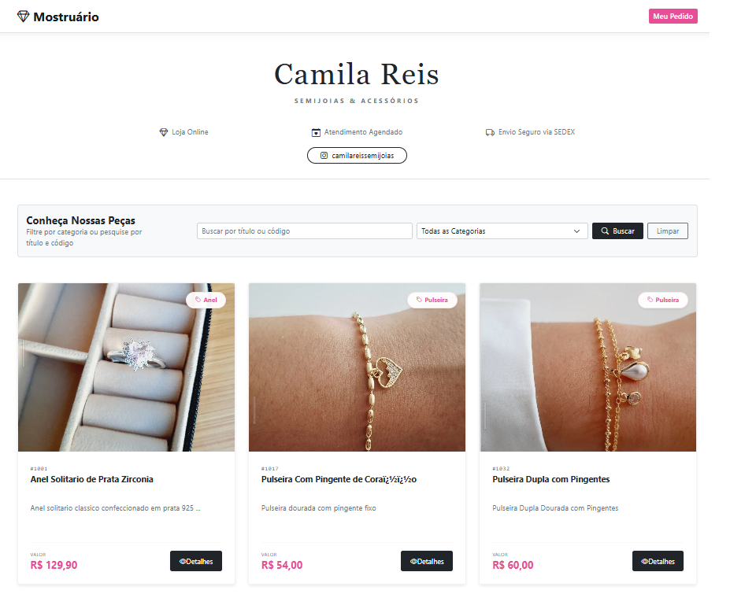
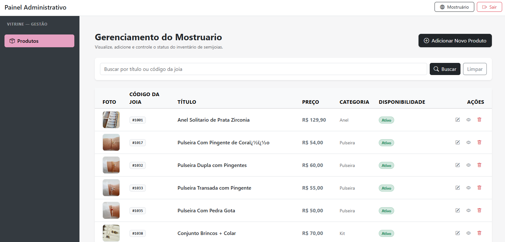
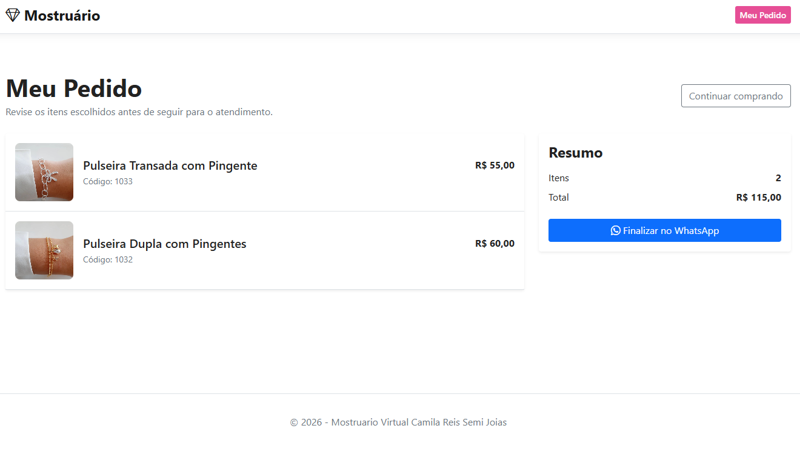
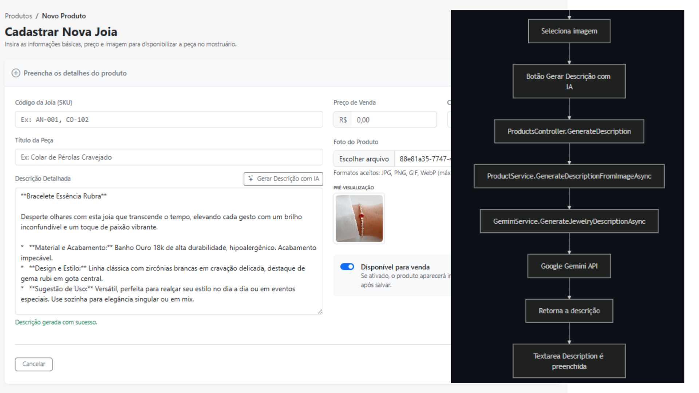

# 💎 Camila Reis — Vitrine de Semijoias & Acessórios

Site desenvolvido em ASP.NET Core 8 MVC para o **FDEVS2026** que serve como catálogo interativo e gerenciador de vitrine digital. O sistema foi projetado sob princípios sólidos de engenharia de software para otimizar a exibição de produtos, profissionalizar o contato com o cliente e eliminar gargalos logísticos do comércio tradicional por redes sociais.



## ⭐  Sumário
  Neste Repositorio
- [Desafios FDevs](./Docs/README-fdevs.md)
- [Documentacao WebSite](./VitrineSemiJoias/READMEmvc.md)
- [Documentacao Projeto de Testes](./Tests/READMEtests.md)
---
 Neste Readme
  - [O Cenário & O Problema](#o-cenário--o-problema)
  - [A Solução Desenvolvida](#a-solução-desenvolvida)
  - [Benefícios para o Negócio](#benefícios-para-o-negócio)
  - [Principais Funcionalidades](#funcionalidades)
    - [Geração de Descrição com IA](#geração-de-descrição-com-ia)
  - [Como Executar o Projeto](#como-executar-o-projeto)
  - [Stack Tecnológica](#stack-tecnológica)
  - [Próximas Etapas & Roadmap de Evolução](#próximas-etapas--roadmap-de-evolução)

---

## 🎯 O Cenário & O Problema

O modelo original de vendas da marca baseava-se na postagem em massa de fotos no Status do WhatsApp. Embora acessível, essa abordagem gerava dores profundas para a empreendedora e suas clientes:


* **Gargalo de Conexão (UX Prejudicada):** O carregamento de dezenas de mídias sequenciais no WhatsApp consome muitos dados. Em conexões instáveis, as fotos demoram para carregar, gerando atrito e fazendo com que potenciais clientes desistam de ver as peças;

* **Refugo de Trabalho e Volatilidade:** Como os status expiram rigidamente a cada 24 horas, havia a necessidade constante de reupload manual das mesmas mídias, gerando um esforço repetitivo e ineficiente;

* **Desgaste Logístico:** A marca realiza atendimentos presenciais e a domicílio. Depender exclusivamente do transporte e da abertura do mostruário físico para apresentar todo o catálogo gera desgaste prático, além de limitar o tempo de escolha da cliente.

## 🚀 A Solução Desenvolvida

O sistema centraliza o catálogo de forma persistente, leve e sempre disponível, transformando a experiência de compra e venda.

> 📝 **Nota de Implementação:** Para conferir os detalhes técnicos do WebSite, acesse o **[README do projeto MVC](./VitrineSemiJoias/READMEmvc.md)**.

## 💼 Benefícios para o Negócio

* **Navegação Fluida:** Interface responsiva e otimizada para carregar rapidamente em redes móveis limitadas;

* **Filtro Inteligente:** Escaneamento rápido de peças por categorias (Anéis, Brincos, Colares), sem a necessidade de rolar por dezenas de stories expirados;

* **Visualização Avançada:** Modais intuitivos para conferir códigos, especificações de banho e preços de forma imediata antes de iniciar o atendimento;

* **Catálogo Permanente:** Fim do ciclo de expiração de 24 horas. O produto fica disponível na nuvem, a disponibidade e exibição das peça pode ser alterada com facilidade na área administrativa;

* **Otimização do Tempo Presencial:** A cliente navega pela vitrine antes do encontro presencial, selecionando previamente as peças de interesse, tornando o atendimento focado e estratégico;

* **Painel Administrativo Isolado:** Controle absoluto para cadastro, edição, exclusão e gerenciamento visual de estoque/disponibilidade.

## ✨ Principais Funcionalidades
- 📊 **Catálogo de Produtos** - Visualização pública do catálogo de semi-jóias com filtros
- 🔐 **Área Administrativa e Autenticação Segura** - Sistema de autenticação com ASP.NET Core Identity, cookies de autenticação
- 🛍️ **CRUD Completo de Produtos** - Criar, ler, atualizar e deletar produtos com validações robustas


---
- 🧾 **Carrinho em Sessão e Pedido via WhatsApp** - Itens mantidos em sessão e finalização do pedido com geração de mensagem para o WhatsApp


---
### 🤖 Geração de Descrição com IA

O cadastro de produtos também conta com um fluxo opcional de apoio à escrita da descrição. Na tela de novo produto, o administrador seleciona uma imagem e usa o botão de geração para enviar o arquivo ao serviço de IA; a resposta retorna como texto pronto para edição antes do salvamento final.



Para configurar o recurso, preencha a seção `Gemini` no `appsettings.json`:

```json
"Gemini": {
  "Model": "gemini-2.5-flash",
  "Prompt": "Descreva a peça com foco em material, banho, estilo e ocasião de uso.",
  "ApiKey": "SUA_CHAVE_GEMINI"
}
```

* **Validação do arquivo:** o fluxo aceita apenas imagens válidas e exibe feedback quando o arquivo selecionado é inválido ou excede o tamanho permitido.

## 🚀 Como Executar o Projeto

### Pré-requisitos
- **.NET 8 SDK** `winget install Microsoft.DotNet.SDK.8`
- **SQL Server** (ou LocalDB) - Incluído no Visual Studio
- **Git** - Para clonar o repositório


```bash
  git clone https://github.com/seu-usuario/vitrine-semi-joias.git
```

```bash
  cd vitrine-semi-joias
```

```bash
  dotnet restore
```

```bash
  dotnet ef database update
```

```bash
  sqlcmd-S"(localdb)\MSSQLLocalDB"-dDB_Vitrine_Semi_Joias-i.\Data\INSERTS.sql
```

```bash
  dotnet watch run
```

A aplicação estará disponível em: `https://localhost:7000` ou `http://localhost:5000`

---

### 📁 Estrutura do Projeto

```text
VITRINE-SEMI-JOIAS/
├── .github/              # Configurações do GitHub (Workflows de CI/CD)
├── Docs/                 # Documentação complementar do projeto
├── Tests/                # Projetos de testes (Unitários e de Integração)
├── VitrineSemiJoias/     # Código-fonte principal da Aplicação Web
├── .gitignore            # Arquivo de mapeamento para ignorar no Git
├── README.md             # Documentação principal do repositório
└── VitrineSemiJoias.sln  # Arquivo de Solução do .NET
```

---

## 🔑 Credenciais Padrão

Uma conta administrador padrão é criada automaticamente nas migrations:

- **Email**: `camila@admin.com`

- **Senha**: `123456`

## 📚 Stack Tecnológica

### 🖥️ Backend & Infraestrutura

* **.NET 8 & ASP.NET Core MVC** - Framework principal e padrão arquitetural da aplicação.
* **Entity Framework Core** - ORM para mapeamento e persistência de dados.
* **SQL Server** - Banco de dados relacional.
* **ASP.NET Core Identity** - Mecanismo nativo para autenticação segura e controle de acesso.
* **AutoMapper** - Abstração e mapeamento automatizado entre Entidades e DTOs.

### 🎨 Frontend & UI

* **Bootstrap 5** - Framework CSS para estilização e responsividade mobile-first.
* **jQuery & jQuery Validation** - Manipulação assíncrona do carrinho e validações client-side.

### 🧪 Qualidade de Código & CI/CD
Para garantir a confiabilidade das regras de negócio e a estabilidade das integrações, o sistema conta com uma suíte de testes automatizados e uma esteira de Integração Contínua (CI) configurada via GitHub Actions.

* **xUnit** - Ecossistema para execução de testes automatizados.
* **NSubstitute** - Ferramenta para criação de dublês de teste (Mocks) de forma fluida.
* **GitHub Actions** - Automação da esteira de Integração Contínua (CI).

> 📝 **Nota de Implementação:** Para conferir os detalhes técnicos de cobertura, cenários testados, padrões adotados e instruções de execução, acesse o **[README do projeto de testes](./Tests/READMEtests.md)**.

## 🔮 Próximas Etapas & Roadmap de Evolução

### 🎨 3. Experiência do Usuário (UI/UX) & Frontend

* **Trilha de Frontend FDEVS:** Evolução do frontend da vitrine aplicando conceitos maduros de UI/UX (Consistência visual, acessibilidade, hierarquia de elementos e micro-interações de feedback).

* **Otimização de Mostruário:** Refinamento dos fluxos de navegação para tornar o catálogo ainda mais responsivo e fluido para o cliente final.

### 🛒 4. Funcionalidades de Negócio (Admin)

* **Módulo de Pedidos Admin:** Persistência de dados das intenções de compra geradas pelo carrinho assíncrono em uma tabela dedicada de `Pedidos` para rastreamento.

* **Checkout Condicional:** Modificação do comportamento do fluxo de finalização caso o administrador esteja autenticado, direcionando-o para uma tela interna de gestão da ordem de serviço em vez do redirecionamento padrão para o WhatsApp do cliente.
