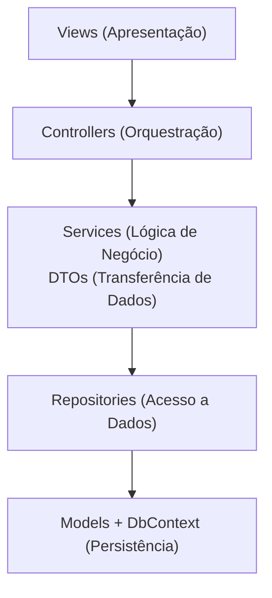
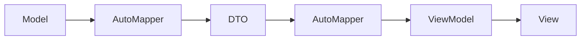
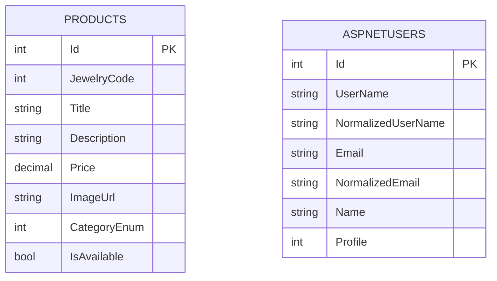

## 🏗️ Arquitetura e Padrões de Projeto

O projeto adota uma arquitetura em camadas, fundamentada nos princípios SOLID e no desacoplamento de código para garantir manutenibilidade e testabilidade.



## 🔄 Padrões Implementados

***Repository Pattern:** Abstração completa da camada de dados (IProductRepository), isolando o Entity Framework das regras de negócio e facilitando a escrita de testes unitários;

***Service Layer Pattern:** Toda a lógica de negócio, validações e regras de validação visual ficam concentradas na camada de serviços (ProductService), mantendo os Controllers limpos;

***Data Transfer Objects (DTOs) & ViewModels:** Proteção das entidades de domínio. O tráfego de dados entre camadas é mapeado via DTOs, e a exibição final é tratada em ViewModels customizadas;

***Dependency Injection (DI):** Gerenciamento centralizado do tempo de vida das dependências configurado de forma limpa em `Configurations/DependencyInjectionConfig.cs`;

***AutoMapper Integration:** Eliminação de código boilerplate. O mapeamento entre objetos (Model ↔ DTO ↔ ViewModel) ocorre de forma automatizada e segura:



***Tratamento de Erros e Padrões de Falha:** Abordagem prática aplicada no projeto:

  ***Serviços:** A camada de `Services` captura exceções em `try/catch`, registra o erro (`logger.LogError`) e converte o resultado em `Result`/`Result<T>`; quando necessário faz limpeza de efeitos colaterais (por exemplo, remover imagens gravadas em disco se o cadastro falhar).

  ***Controllers:** Validações e guard-clauses (ModelState, parâmetros nulos, enums inválidos) são tratadas com `Early Return`, retornando `NotFound`, `BadRequest` ou mensagens amigáveis via `TempData` sem criar aninhamento profundo.

  ***Handler global:** Em ambiente não-desenvolvimento, `UseExceptionHandler` centraliza o tratamento de exceções não previstas e redireciona para `HomeController.Error` para uma página de erro unificada.

  ***Fail-Fast (parcial):** O projeto aplica rejeição precoce para entradas inválidas, porém adota um modelo de falha controlada na camada de serviço (captura de exceções e retorno encapsulado) em vez de permitir que exceções não tratadas subam livremente

## ✨ Funcionalidades

- 🛍️ **CRUD Completo de Produtos**: Interface administrativa para criar, visualizar, editar e excluir produtos. As ações respeitam regras de negócio (estoque, categorias e visibilidade) e retornam mensagens UX claras (sucesso/erro). A camada de serviço encapsula a lógica e a camada de repositório trata da persistência.

- 📸 **Gerenciamento de Imagens**: Upload seguro de imagens com validação de tipo/bytes e redimensionamento opcional no servidor. Arquivos são armazenados em `wwwroot` com nomes gerados para evitar colisões e caminhos são persistidos no banco para exibição nas views.

- 🗑️ **Exclusão de Arquivos Físicos**: Quando um produto é removido, o sistema elimina também os arquivos de imagem associados (se não usados por outros registros), evitando lixo no disco. A operação é realizada de forma transacional quando possível para manter consistência.

- 🔐 **Autenticação Segura**: Integração com ASP.NET Core Identity para cadastro, login, logout, e recuperação de senha. Cookies de autenticação são configurados com políticas seguras e as rotas administrativas exigem autorização baseada em `ProfileEnum`.

- 👤 **Área Administrativa**: Painel restrito a usuários autorizados para gerenciar catálogo e imagens. Controles com validação de entrada, proteção contra CSRF e feedback imediato para o usuário (TempData / toasts).

- 📊 **Catálogo de Produtos**: Página pública com listagem paginada e filtros por categoria/preço. Dados são obtidos de forma otimizada pelo repositório (projeções via DTO/ViewModel) para evitar carregamento desnecessário de imagens ou propriedades.

- 🛒 **Carrinho Assíncrono**: Adição/remoção de itens ao carrinho via chamadas AJAX, mantendo a experiência do usuário sem reload. Toastr (Bootstrap) apresenta confirmações e erros, e as operações atualizam a sessão do usuário em tempo real.

- 🧾 **Carrinho em Sessão e Pedido via WhatsApp**: Itens do carrinho são mantidos na sessão (serializados como DTO/ViewModel). Ao finalizar, o sistema gera uma mensagem formatada pronta para envio via WhatsApp (URL/estrutura), facilitando a conversão de pedidos sem gateway de pagamento.

- 🏷️ **Filtro de Categoria Persistente**: O seletor de categoria da vitrine salva a última seleção (via query string, sessão ou localStorage), garantindo que a escolha do cliente persista após reloads e navegações.

- 💾 **Persistência de Dados (EF Core)**: Projeto usa Entity Framework Core com migrations para versionamento do esquema. Configurações de entidades (`ProductConfig`, `UserConfig`) seguem convenções e constraints para integridade referencial.

- 🎨 **Interface Responsiva**: Front-end com Bootstrap adaptativo, classes utilitárias e componentes acessíveis para garantir boa apresentação em dispositivos móveis e desktops.

- ✔️ **Validação de Dados (Cliente e Servidor)**: Validações combinadas: DataAnnotations no modelo/DTO, validação adicional na camada de serviço e validação client-side com jQuery Validation para melhor experiência e segurança.

Cada uma dessas funcionalidades é implementada em camadas separadas (`Controllers`, `Services`, `Repository`, `DTOs`, `ViewModels`), seguindo princípios de responsabilidade única e facilitando testes automatizados.

## 🗄️ Estrutura do Banco de Dados

O banco de dados do projeto combina as tabelas de negócio com a estrutura padrão do ASP.NET Core Identity. O diagrama abaixo foi simplificado para destacar apenas as tabelas usadas diretamente no projeto; as demais tabelas do Identity existem como infraestrutura do próprio framework e não fazem parte da lógica de domínio da aplicação:



***Products:** tabela principal do catálogo, controlada pelo `AppDbContext` e usada no CRUD administrativo.

***AspNetUsers:** usuários autenticáveis do sistema, com os campos adicionais `Name` e `Profile` definidos em `UserModel`.

***Observação:** a aplicação não possui relacionamento direto entre `Products` e as tabelas do Identity; o vínculo de autenticação é independente da gestão do catálogo.

## 📁 Estrutura de Pastas

```

vitrine-semi-joias/

├── Controllers/         # Controladores MVC
├── Models/              # Modelos de domínio
├── DTOs/                # Data Transfer Objects
├── ViewModels/          # Modelos para Views
├── Services/            # Lógica de negócio
├── Repository/          # Padrão Repository
├── Data/                # Configuração do DbContext e Entidades
├── Migrations/          # Migrations do Entity Framework
├── Views/               # Templates Razor
├── wwwroot/             # Arquivos estáticos (CSS, JS, imagens)
├── Common/              # Utilitários compartilhados
├── Configurations/      # Configurações de DI e AutoMapper
├── Enums/               # Enumerações
└── Properties/          # Configurações do projeto

```

## 🔌 Extensibilidade para API

A aplicação hoje está configurada como **MVC com views Razor**. Isso significa que os controllers atuais atendem a páginas e fluxos tradicionais de navegação, mas a base já está preparada para evoluir para endpoints de API sem reestruturar o domínio.

Na prática, a arquitetura atual já favorece essa evolução porque a lógica de negócio está concentrada em `Services/` e o acesso a dados em `Repository/`.